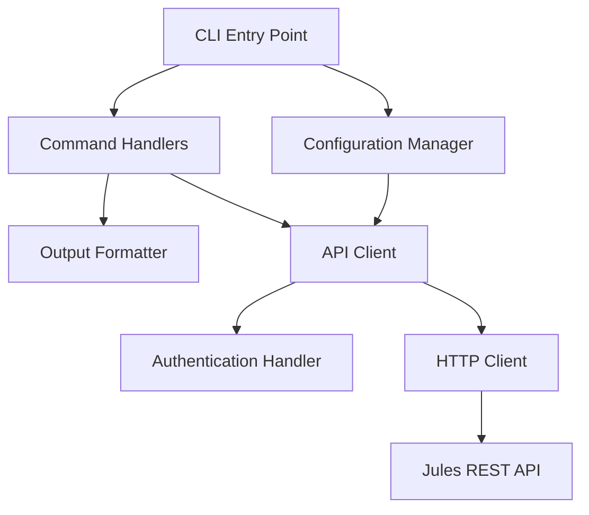

# Design Document: Jules CLI Tool

## Overview

The Jules CLI Tool is a Python command-line application that provides a user-friendly interface to the Jules REST API. The tool enables developers to manage sources, sessions, activities, and agent interactions directly from the terminal, with support for multiple authentication methods, flexible output formatting, and comprehensive error handling.

### Key Design Goals

- **Simplicity**: Intuitive command structure following standard CLI conventions
- **Flexibility**: Multiple authentication methods and output formats
- **Robustness**: Comprehensive error handling with clear user feedback
- **Scriptability**: JSON output support for integration with other tools
- **Maintainability**: Clean separation between CLI interface, API client, and business logic

### Technology Stack

- **Language**: Python 3.8+
- **CLI Framework**: Click (for command parsing and help generation)
- **HTTP Client**: requests library
- **Configuration**: TOML format via tomli/tomllib
- **Output Formatting**: tabulate for table output, json for JSON output

## Architecture

### High-Level Architecture

The CLI tool follows a layered architecture with clear separation of concerns:

```
┌─────────────────────────────────────────┐
│         CLI Interface Layer             │
│  (Command definitions, argument parsing)│
└──────────────┬──────────────────────────┘
               │
┌──────────────▼──────────────────────────┐
│      Business Logic Layer               │
│  (Command handlers, output formatting)  │
└──────────────┬──────────────────────────┘
               │
┌──────────────▼──────────────────────────┐
│         API Client Layer                │
│  (HTTP requests, authentication)        │
└──────────────┬──────────────────────────┘
               │
┌──────────────▼──────────────────────────┐
│         Jules REST API                  │
└─────────────────────────────────────────┘
```

### Component Architecture



### Directory Structure

```
jules-cli/
├── jules_cli/
│   ├── __init__.py
│   ├── __main__.py          # Entry point
│   ├── cli.py               # CLI interface (Click commands)
│   ├── client.py            # API client implementation
│   ├── config.py            # Configuration management
│   ├── formatter.py         # Output formatting
│   ├── exceptions.py        # Custom exceptions
│   └── constants.py         # API endpoints and constants
├── tests/
│   ├── test_cli.py
│   ├── test_client.py
│   ├── test_config.py
│   └── test_formatter.py
├── pyproject.toml
├── README.md
└── setup.py
```

## Components and Interfaces

### 1. CLI Interface Layer (`cli.py`)

The CLI interface uses Click to define commands and handle argument parsing.

**Main Command Group:**
```python
@click.group()
@click.option('--api-key', envvar='JULES_API_KEY', help='API key for authentication')
@click.option('--format', type=click.Choice(['json', 'table', 'plain']), default='table')
@click.option('--verbose', is_flag=True, help='Enable verbose logging')
@click.option('--version', is_flag=True, help='Show version')
@click.pass_context
def cli(ctx, api_key, format, verbose, version):
    """Jules CLI - Command-line interface for Jules REST API"""
```

**Command Structure:**
- `jules sources list` - List available sources
- `jules sessions create <source-id>` - Create a new session
- `jules sessions list` - List all sessions
- `jules sessions get <session-id>` - Get session details
- `jules sessions approve <session-id>` - Approve a plan
- `jules activities list <session-id>` - List activities
- `jules agent send <session-id> <message>` - Send message to agent
- `jules config init` - Initialize configuration file

### 2. API Client Layer (`client.py`)

The API client encapsulates all HTTP interactions with the Jules REST API.

**Interface:**
```python
class JulesAPIClient:
    def __init__(self, api_key: str, base_url: str = "https://jules.googleapis.com/v1alpha", 
                 verbose: bool = False):
        """Initialize API client with authentication"""
        
    def list_sources(self) -> dict:
        """GET /sources - List all available sources"""
        
    def create_session(self, source_id: str, **kwargs) -> dict:
        """POST /sessions - Create a new session"""
        
    def list_sessions(self, status: Optional[str] = None) -> dict:
        """GET /sessions - List all sessions"""
        
    def get_session(self, session_id: str) -> dict:
        """GET /sessions/{session_id} - Get session details"""
        
    def approve_plan(self, session_id: str) -> dict:
        """POST /sessions/{session_id}/approve - Approve a plan"""
        
    def list_activities(self, session_id: str) -> dict:
        """GET /sessions/{session_id}/activities - List activities"""
        
    def send_message(self, session_id: str, message: str) -> dict:
        """POST /sessions/{session_id}/messages - Send message to agent"""
        
    def _make_request(self, method: str, endpoint: str, **kwargs) -> dict:
        """Internal method to make HTTP requests with error handling"""
```

**Authentication:**
- API key passed via `X-Goog-Api-Key` header on all requests
- Verbose mode logs requests/responses with redacted API key

**Error Handling:**
- Raises custom exceptions for different HTTP status codes
- Maps status codes to user-friendly error messages

### 3. Configuration Manager (`config.py`)

Manages configuration file reading, writing, and validation.

**Interface:**
```python
class ConfigManager:
    CONFIG_FILE = Path.home() / ".jules-cli" / "config.toml"
    
    @classmethod
    def init_config(cls, api_key: Optional[str] = None, 
                   output_format: str = "table") -> None:
        """Initialize configuration file"""
        
    @classmethod
    def load_config(cls) -> dict:
        """Load configuration from file"""
        
    @classmethod
    def get_api_key(cls, cli_key: Optional[str], env_key: Optional[str]) -> str:
        """Get API key with priority: CLI > ENV > Config File"""
        
    @classmethod
    def validate_config(cls, config: dict) -> bool:
        """Validate configuration file format"""
```

**Configuration File Format (TOML):**
```toml
[auth]
api_key = "your-api-key-here"

[output]
format = "table"  # json, table, or plain
```

**Priority Order:**
1. Command-line flag (`--api-key`)
2. Environment variable (`JULES_API_KEY`)
3. Configuration file (`~/.jules-cli/config.toml`)

### 4. Output Formatter (`formatter.py`)

Handles formatting of API responses for different output modes.

**Interface:**
```python
class OutputFormatter:
    def __init__(self, format_type: str = "table"):
        """Initialize formatter with output type"""
        
    def format_sources(self, sources: list) -> str:
        """Format sources list"""
        
    def format_sessions(self, sessions: list) -> str:
        """Format sessions list"""
        
    def format_session_details(self, session: dict) -> str:
        """Format single session details"""
        
    def format_activities(self, activities: list) -> str:
        """Format activities list"""
        
    def format_message_response(self, response: dict) -> str:
        """Format agent message response"""
        
    def format_error(self, error: Exception) -> str:
        """Format error message"""
```

**Format Types:**
- **JSON**: Direct JSON serialization of API responses
- **Table**: Tabular format using tabulate library
- **Plain**: Simple text output for scripting

### 5. Exception Handling (`exceptions.py`)

Custom exceptions for different error scenarios.

**Exception Hierarchy:**
```python
class JulesAPIError(Exception):
    """Base exception for Jules API errors"""
    
class AuthenticationError(JulesAPIError):
    """Raised for 401 authentication errors"""
    
class ResourceNotFoundError(JulesAPIError):
    """Raised for 404 not found errors"""
    
class RateLimitError(JulesAPIError):
    """Raised for 429 rate limit errors"""
    
class ServerError(JulesAPIError):
    """Raised for 5xx server errors"""
    
class NetworkError(JulesAPIError):
    """Raised for network connection errors"""
    
class ConfigurationError(JulesAPIError):
    """Raised for configuration file errors"""
```

## Data Models

### API Response Models

The CLI tool works with JSON responses from the Jules API. Key data structures:

**Source:**
```python
{
    "id": str,           # Source identifier
    "type": str,         # Source type (e.g., "github")
    "name": str,         # Human-readable name
    "url": str           # Source URL
}
```

**Session:**
```python
{
    "id": str,                    # Session identifier
    "source_id": str,             # Associated source
    "status": str,                # Session status
    "created_at": str,            # ISO 8601 timestamp
    "updated_at": str,            # ISO 8601 timestamp
    "has_pending_plan": bool      # Whether plan needs approval
}
```

**Activity:**
```python
{
    "id": str,           # Activity identifier
    "session_id": str,   # Parent session
    "type": str,         # Activity type
    "status": str,       # Activity status
    "created_at": str,   # ISO 8601 timestamp
    "details": dict      # Activity-specific details
}
```

**Message Response:**
```python
{
    "message_id": str,      # Message identifier
    "response": str,        # Agent response text
    "timestamp": str        # ISO 8601 timestamp
}
```

### Configuration Model

**Config File Structure:**
```python
{
    "auth": {
        "api_key": str      # API authentication key
    },
    "output": {
        "format": str       # Default output format
    }
}
```

### Internal Data Flow

1. **Command Invocation**: User executes command with arguments
2. **Configuration Loading**: Load API key from CLI/ENV/Config with priority
3. **API Client Creation**: Initialize client with API key and verbose flag
4. **API Request**: Client makes HTTP request to Jules API
5. **Response Handling**: Parse JSON response or handle errors
6. **Output Formatting**: Format response based on output format flag
7. **Display**: Print formatted output to stdout
8. **Exit**: Return appropriate exit code (0 for success, non-zero for errors)


## Correctness Properties

A property is a characteristic or behavior that should hold true across all valid executions of a system—essentially, a formal statement about what the system should do. Properties serve as the bridge between human-readable specifications and machine-verifiable correctness guarantees.

### Property Reflection

After analyzing all acceptance criteria, several redundant properties were identified and consolidated:

- Error handling properties (2.3, 3.3, 4.3, 5.3, 6.3, 7.3, 8.3) all test the same behavior: API errors are displayed to users. These are consolidated into Property 2.
- Success exit code properties (3.5, 6.5) are specific cases of the general success/error exit code behavior, consolidated into Property 3.
- Output format examples (2.4, 2.5, 4.4, 4.5, 5.5, 7.4, 7.5, 8.6, 10.1-10.4) test the same formatting capability across different commands, consolidated into examples rather than separate properties.
- Verbose logging properties (14.2, 14.3) both test that HTTP details are logged, consolidated into Property 13.

### Property 1: API Key Priority Order

For any combination of API key sources (command-line flag, environment variable, configuration file), the CLI tool should use the API key from the highest priority source: command-line flag takes precedence over environment variable, which takes precedence over configuration file.

**Validates: Requirements 1.1, 1.2, 1.3, 1.4**

### Property 2: API Error Display

For any API request that fails with an error response from the Jules API, the CLI tool should display the error message from the API response to the user.

**Validates: Requirements 2.3, 3.3, 4.3, 5.3, 6.3, 7.3, 8.3**

### Property 3: Exit Code Correctness

For any command execution, the CLI tool should exit with status code 0 when the operation succeeds and exit with a non-zero status code when any error occurs.

**Validates: Requirements 1.5, 3.5, 5.4, 6.5, 9.6**

### Property 4: API Key Header Inclusion

For any API request made by the CLI tool, the request should include the API key in the X-Goog-Api-Key header.

**Validates: Requirements 1.6**

### Property 5: Optional Parameter Pass-Through

For any optional parameters provided to the session creation command, those parameters should be included in the API request to the Jules API.

**Validates: Requirements 3.4**

### Property 6: Session Filter Pass-Through

For any status filter provided to the list sessions command, that filter should be included in the API request to the Jules API.

**Validates: Requirements 4.6**

### Property 7: Complete Field Display

For any successful API response containing structured data (sources, sessions, activities), the formatted output should include all key fields from the response (identifiers, timestamps, types, etc.).

**Validates: Requirements 4.2, 5.2, 7.2, 8.2**

### Property 8: Chronological Activity Ordering

For any list of activities returned by the API, the CLI tool should display them in chronological order based on their creation timestamps.

**Validates: Requirements 7.6**

### Property 9: Server Error Handling

For any API response with a 5xx status code, the CLI tool should display a server error message to the user.

**Validates: Requirements 9.4**

### Property 10: JSON Output Validity

For any command output in JSON format, the output should be valid JSON that can be successfully parsed by standard JSON parsers.

**Validates: Requirements 10.5**

### Property 11: JSON Round-Trip Property

For any valid API response, formatting the response to JSON, then parsing it, then formatting it again should produce equivalent output to the original formatting.

**Validates: Requirements 10.6**

### Property 12: Configuration Persistence

For any configuration value (API key, output format) provided during configuration initialization, that value should be stored in the configuration file and retrievable on subsequent reads.

**Validates: Requirements 11.3, 11.4**

### Property 13: Configuration Validation

For any configuration file read by the CLI tool, if the file format is invalid, the tool should display an error message and ignore the file rather than crashing.

**Validates: Requirements 11.5, 11.6**

### Property 14: Command Help Availability

For any command in the CLI tool, using the help flag with that command should display help information specific to that command.

**Validates: Requirements 12.2**

### Property 15: Help Content Completeness

For any command's help output, it should include the command syntax with required and optional parameters, and examples of usage.

**Validates: Requirements 12.4, 12.5**

### Property 16: Verbose HTTP Logging

For any HTTP request or response when verbose mode is enabled, the CLI tool should log the request details (URL, headers) and response details (status code, body).

**Validates: Requirements 14.2, 14.3**

### Property 17: API Key Redaction

For any log output containing an API key when verbose mode is enabled, the API key should be displayed in redacted form rather than plaintext.

**Validates: Requirements 14.4**

### Property 18: Verbose Mode Suppression

For any command execution when verbose mode is disabled, the CLI tool should only display command results and errors, without detailed HTTP logging.

**Validates: Requirements 14.5**

### Example-Based Test Cases

The following acceptance criteria are best validated through specific example tests rather than property-based tests:

- **Command Existence Tests**: Verify specific commands exist (2.1, 3.1, 4.1, 5.1, 6.1, 7.1, 8.1, 11.1, 12.1, 13.1, 14.1)
- **Missing API Key Error**: Verify error when no API key provided (1.5)
- **Output Format Support**: Verify JSON, table, and plain text formats work (2.4, 2.5, 4.4, 4.5, 5.5, 7.4, 7.5, 8.6, 10.1-10.4)
- **Stdin Message Input**: Verify message can be read from stdin (8.5)
- **HTTP Status Code Errors**: Verify specific error messages for 401, 404, 429 (9.1, 9.2, 9.3)
- **Network Error Handling**: Verify connection error message (9.5)
- **Config File Location**: Verify config stored in home directory (11.2)
- **No Arguments Behavior**: Verify help shown when no arguments (12.3)
- **Version Format**: Verify semantic versioning format (13.2, 13.3)

## Error Handling

### Error Categories

The CLI tool handles errors in the following categories:

1. **Authentication Errors (401)**
   - Message: "Authentication failed. Please check your API key."
   - Exit code: 1

2. **Resource Not Found (404)**
   - Message: "Resource not found: {resource_type} '{resource_id}' does not exist."
   - Exit code: 1

3. **Rate Limiting (429)**
   - Message: "Rate limit exceeded. Please try again later."
   - Exit code: 1

4. **Server Errors (5xx)**
   - Message: "Server error occurred. Please try again later. (Status: {status_code})"
   - Exit code: 1

5. **Network Errors**
   - Message: "Connection error: Unable to reach Jules API at {url}"
   - Exit code: 1

6. **Configuration Errors**
   - Message: "Configuration error: {specific_error}"
   - Exit code: 1

7. **Missing API Key**
   - Message: "API key required. Provide via --api-key flag, JULES_API_KEY environment variable, or config file."
   - Exit code: 1

### Error Handling Strategy

**API Client Layer:**
- Catch all HTTP exceptions from requests library
- Map HTTP status codes to custom exception types
- Include relevant context (URL, status code, response body) in exceptions

**CLI Layer:**
- Catch all custom exceptions from API client
- Format error messages for user display
- Log full error details in verbose mode
- Always exit with non-zero status code on errors

**Configuration Layer:**
- Validate configuration file format before parsing
- Provide clear error messages for invalid TOML syntax
- Gracefully handle missing configuration file (not an error)
- Validate required fields are present

### Error Recovery

- **Transient Errors (429, 5xx)**: Suggest user retry later
- **Authentication Errors**: Direct user to check API key
- **Not Found Errors**: Suggest user verify resource ID
- **Network Errors**: Suggest checking internet connection
- **Configuration Errors**: Provide specific fix instructions

## Testing Strategy

### Dual Testing Approach

The CLI tool will use both unit testing and property-based testing to ensure comprehensive coverage:

- **Unit Tests**: Verify specific examples, edge cases, command existence, and error conditions
- **Property Tests**: Verify universal properties hold across all inputs using randomized testing

### Unit Testing

Unit tests will focus on:

1. **Command Existence**: Verify all commands are registered and callable
2. **Specific Error Scenarios**: Test 401, 404, 429, network errors with mocked responses
3. **Output Format Examples**: Test JSON, table, and plain text formatting with sample data
4. **Configuration File Operations**: Test init, read, validate with specific config files
5. **Edge Cases**: Empty responses, missing fields, malformed JSON
6. **Integration Points**: CLI → API Client → HTTP layer interactions

**Testing Framework**: pytest

**Mocking Strategy**: Use `responses` library to mock HTTP requests, avoiding actual API calls

**Example Unit Test:**
```python
def test_list_sources_json_format(mock_api):
    """Test that list sources command outputs valid JSON"""
    mock_api.get('/sources', json={'sources': [{'id': 'src1', 'name': 'Test'}]})
    result = runner.invoke(cli, ['--format', 'json', 'sources', 'list'])
    assert result.exit_code == 0
    data = json.loads(result.output)
    assert 'sources' in data
```

### Property-Based Testing

Property tests will verify universal behaviors across randomized inputs:

**Testing Framework**: Hypothesis (Python property-based testing library)

**Configuration**: Minimum 100 iterations per property test

**Property Test Tagging**: Each test must reference its design property:
```python
# Feature: jules-cli-tool, Property 1: API Key Priority Order
@given(cli_key=text(), env_key=text(), config_key=text())
def test_api_key_priority(cli_key, env_key, config_key):
    """For any combination of API keys, CLI flag takes precedence"""
    # Test implementation
```

**Properties to Test:**

1. **Property 1 - API Key Priority**: Generate random API keys for each source, verify correct priority
2. **Property 2 - API Error Display**: Generate random error responses, verify error message displayed
3. **Property 3 - Exit Code Correctness**: Generate random success/error scenarios, verify exit codes
4. **Property 4 - API Key Header**: Generate random API keys, verify header inclusion
5. **Property 5 - Optional Parameters**: Generate random optional parameters, verify pass-through
6. **Property 6 - Session Filters**: Generate random filter values, verify pass-through
7. **Property 7 - Complete Field Display**: Generate random API responses, verify all fields present
8. **Property 8 - Chronological Ordering**: Generate random activity lists, verify sorted output
9. **Property 9 - Server Error Handling**: Generate random 5xx codes, verify error message
10. **Property 10 - JSON Validity**: Generate random command outputs, verify JSON parsing
11. **Property 11 - JSON Round-Trip**: Generate random API responses, verify round-trip equivalence
12. **Property 12 - Config Persistence**: Generate random config values, verify storage and retrieval
13. **Property 13 - Config Validation**: Generate random invalid configs, verify graceful handling
14. **Property 14 - Command Help**: Generate random command names, verify help availability
15. **Property 15 - Help Completeness**: Generate random commands, verify help content
16. **Property 16 - Verbose Logging**: Generate random HTTP requests, verify logging in verbose mode
17. **Property 17 - API Key Redaction**: Generate random API keys, verify redaction in logs
18. **Property 18 - Verbose Suppression**: Generate random commands, verify no verbose output when disabled

**Example Property Test:**
```python
# Feature: jules-cli-tool, Property 11: JSON Round-Trip Property
@given(response_data=dictionaries(text(), text()))
@settings(max_examples=100)
def test_json_round_trip(response_data):
    """For any API response, JSON formatting should round-trip correctly"""
    formatter = OutputFormatter('json')
    output1 = formatter.format_response(response_data)
    parsed = json.loads(output1)
    output2 = formatter.format_response(parsed)
    assert output1 == output2
```

### Test Coverage Goals

- **Line Coverage**: Minimum 90%
- **Branch Coverage**: Minimum 85%
- **Property Test Iterations**: 100 per property
- **Unit Test Count**: ~50-60 tests covering all commands and error scenarios

### Continuous Integration

- Run all tests on every commit
- Fail build if any test fails
- Generate coverage reports
- Run property tests with increased iterations (1000) on release branches

